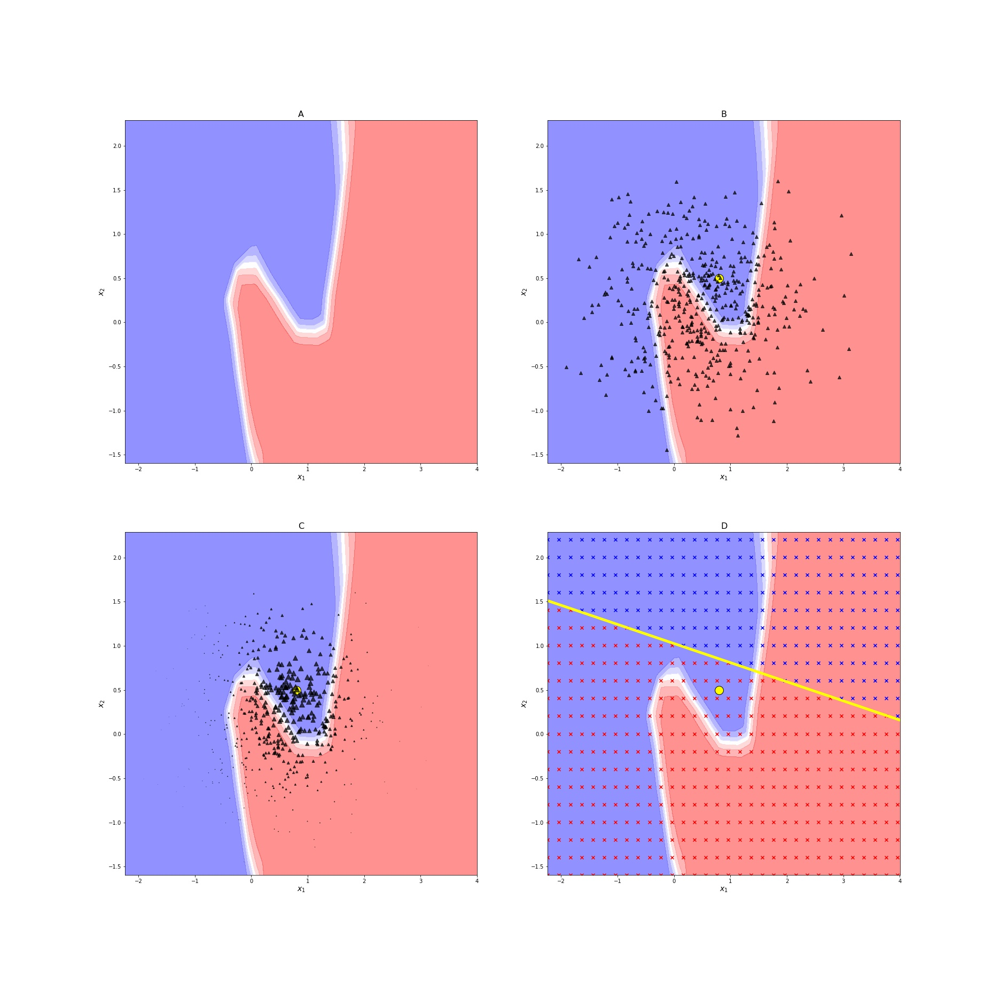

# Eine Demonstration des LIME-Verfahrens zur Interpretation von ML-Modellen am Beispiel strukturierter Daten 
[Ribeiro et al. (2016)](https://doi.org/10.1145/2939672.2939778) stellen in Ihrem Papier das sog. LIME-Verfahren vor. Die Abkürzung LIME steht für "local, interpretable, model-agnostic explanation". Im Zusammenhang mit der Interpretation von Black-Box (BB) Machine Learning Modellen bedeutet lokal, dass es darum geht, die Prognose des BB-Modells für ein ausgewähltes Subjekt zu erklären. Erklären bedeutet hier, dass einer Anwender\*in transparent wird, wie die Merkmalsausprägungen des Subjekts die Prognose des BB-Modells beeinflusst haben.

LIME untersützt neben tabellarischen Daten auch Text- und Bilddaten. Der Erstautor des Papiers, Marco Tulio Correia Ribeiro, stellt in seinem [GitHub-Repository](https://github.com/marcotcr/lime/tree/master/lime) eine leistungsfähige und flexibel einsatzbare Implementierung des LIME-Verfahrens bereit. Dort finden sich auch viele nützliche Beispiele und Erklärungen. Das hier bereitgestellte Notebook `LIME_from_scratch.ipynb` demonstriert wesentliche Schritte des LIME-Verfahrens am Beispiel tabellarischer Daten. Es enthält ferner eine vereinfachte Implementierung des Verfahrens, welche für Lehrzwecke gedacht ist.

Die elementaren Schritte von LIME lassen sich wie folgt zusammenfassen:
1. Lernen eines (nichtlinearen) Modells, dessen Prognosen für einzelne Testfälle erklärt werden sollen (->BB Modell)
2. Wählen eines Subjekts, dessen BB-Prognose erklärt werden soll 
3. Erzeugen künstlicher Daten in der Nachbarschaft des zuvor gewählten Subjekts
4. Prognostizieren der künstlichen Daten durch das BB-Modell
5. Schätzen eines interpretierbaren Modells auf Basis der synthetischen Daten mit der BB-Prognose als Zielvariable. 

Im Anschluss kann die BB-Prognose durch das interpretierbare Modell erklärt werden. Die folgende Abbildung illustriert diese Schritte. Das Notebook erzeugt diese Grafik über die Funktion `LIME_Demo()`.

Referenzen:
- Alvarez-Melis, D., & Jaakkola, T. S. (2018). On the Robustness of Interpretability Methods. ICML Workshop on Human Interpretability in Machine Learning (WHI 2018), Stockholm, Sweden. https://arxiv.org/abs/1806.08049
- Molnar, C. (2019). Interpretable Machine Learning. Victoria, BC, Canada: Leanpub. https://christophm.github.io/interpretable-ml-book/ 
- Ribeiro, M. T., Singh, S., & Guestrin, C. (2016). "Why Should I Trust You?": Explaining the Predictions of Any Classifier. Proceedings of the 22nd ACM SIGKDD International Conference on Knowledge Discovery and Data Mining (ACM KDD2016), ACM: New York, NY, USA. https://doi.org/10.1145/2939672.2939778

